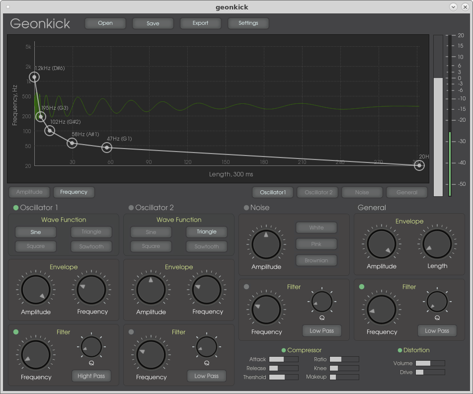

# Geonkick

Geonkick - a kick drum synthesizer.

Author: Iurie Nistor

License: GPLv3

Home page: http://geontime.com

Status: Active development. No release yet.

What version 1.0 should include:

[i] - means implemented
[p] - means partial implemented

* Two oscillators:
     - since [i]
     - square [i]
     - triangle [i]
     - sawtooth [i]
     - amplitude envelope [i]
     - frequency envelope [i]
     - low & hight pass filter [i]
* Noise:
     - white [i]
     - browninan [i]
     - amplitude envelope [i]
     - low & hight pass filter [i]
* Kick
     - amplitude envelope [i]
     - low & hight pass filter [i]
     - kick length [i]
     - kick limiter [i]
     - compression [p]
     - distortion [i]
* Jack support:
     - 1 MIDI in (key velocity sensitive) [i]
     - 2 audio out [i]
* Export to WAVE [i]
     - stereo [i]
     - mono [i]
     - WAV 16. 24. 23 bit [i]
     - FLAC 16, 24 bit [i]
* Save [i]
* Open [i]
* Standalone [i]
* Plugin
     - LV2 [i]
* Platforms:
     - GNU/Linux [i]

