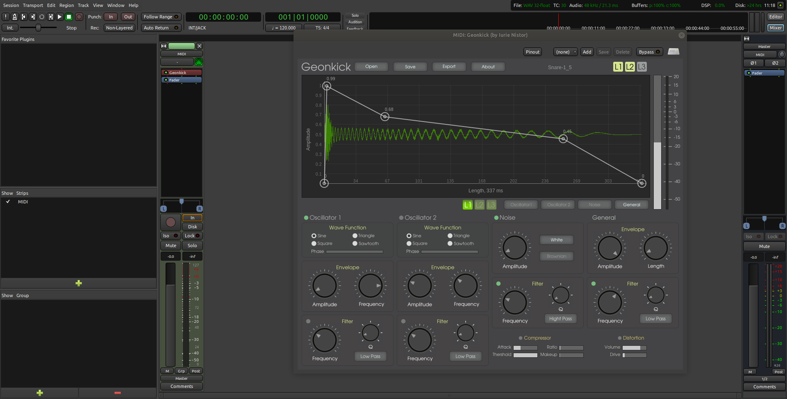

# Geonkick

Geonkick - a free software percussion synthesizer.

Details: Geonkick is a synthesizer that can synthesize elements
	 of percussion. The most basic examples are: kick drums,
	 snares, hit-hats, shakers, claps, steaks.

License: GPLv3

Version: 1.5

Author: Iurie Nistor

Source code repository: https://github.com/quamplex/geonkick

Latest releases can be found on "master" branch or "tags".

The development of new releases is going on branch "develop".

Geonkick on Ardour DAW / Ubuntu

#### Features

* Three layers
* Two oscillators per layer
     - sine, square, triangle, saw-tooth
     - initial phase
     - amplitude & frequency envelope
     - low & high pass filter
* One noise generator per layer
     - white & brownian
     - amplitude envelope
     - low & high pass filter
* General
     - amplitude envelope & kick length
     - low & high pass filter
     - limiter
     - compression
     - distortion
* Jack support:
     - 1 MIDI in, key velocity sensitive
     - 2 audio out
* Export
     - stereo & mono
     - WAV: 16, 24, 32 bit
     - FLAC: 16, 24 bit
     - Ogg Vorbis
* Open & Save preset in JSON format
* Standalone
* Plugin
  - LV2
* Platforms:
  - GNU/Linux
* Build system:
  - GPLv3 source code with CMake build system

#### Requirements

In order Geonkick to run and operate correctly there is a need for:

Standalone:
    * GNU/Linux operating system
    * Jack server installed and running at 48000 sample rate

Plugin:
    * GNU/Linux operaing system
    * LV2 host. For example, a DAW that supports LV2 plugin format.

#### Install

###### Install dependeces

I order to build Geonkick there is a need to install the following development packages:

* [Redkite](https://github.com/quamplex/redkite) GUI toolkit. See the documentation of Redkite toolkit how to install it.
* libsndfile
* RapidJSON (version >= 1.1)
* JACK Audio Connection Kit (optional if building only for LV2)
* LV2 development library

On Debian, Ubuntu, Ubuntu Studio install:

    apt-get install build-essential
    apt-get install cmake
    apt-get install qjackctl && libjack-dev && libsndfile-dev
    apt-get install rapidjson-dev
    apt-get install lv2-dev

###### Build & install Geonkick

Clone the code repository, compile and install

        git clone git@gitlab.com:iurie/geonkick.git
        mkdir geonkick/build
        cd geonkick/build
        cmake ../
        make
        make install

#### Tests
Here is a list of tests of the application on various GNU/Linux distributions
in order to see if it builds with dependences installed from repository,
installs, runs, and if there any issues.

| Distribution  | Dependences  | Build  | Install  | Run  | Comments  |
|:-:|:-:|:-:|:-:|:-:|:-:|
| Debian 9.x/64bit  | repository  | OK  | OK  | OK  |   |
| Ubuntu 18.10/64bit  | repository  | OK  | OK  | OK  |   |
| Fedora 29 / 64 bit  | repository | OK  | OK  | OK  |   |
| Ubuntu Studio  | repository  | OK  | OK  | OK  |   |

#### Packaging

* [Package, for older version 1.0](https://www.archlinux.org/packages/community/x86_64/geonkick/) for ArchLinux community repository by David Runge

#### Road map

Here are a list of planned milestones and issues opened for them,
dates when will be started and finished.

Milestones: https://github.com/quamplex/geonkick/milestones

#### Short user guide

###### Shortcut Keys

* Ctrl + r - reload default state, clean everything
* Ctrl + k - play kick
* Ctrl + h - hide envelope, only kick graph is shown

###### Working with envelopes
* Left double click to add a new point
* Left click on the point and move the point
* Right click on the point to remove it

###### Play the sound
Geonkick uses Jack and will create two audio outputs and one MIDI input.
If audio outputs are connected there are three ways to play the sound:
   * by MIDI input, for example, MIDI keyboard. This also will be key velocity sensitive, i.e. lower velocity corresponds to lower sound volume.
   * by pressing the key 'Ctrl + k'
   * Throught host/LV2 or a DAW.

###### Examples

Under the directory geonkick/examples there are some example presets that can be opened and play with.
