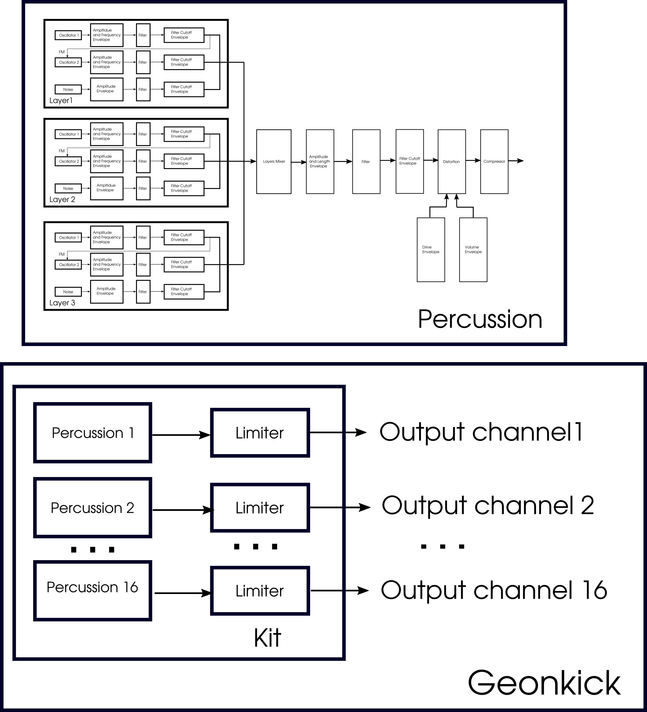

# Geonkick

Geonkick - a [free software](https://www.gnu.org/philosophy/free-sw.en.html) percussion synthesizer.

Geonkick is a synthesizer that can synthesize elements
of percussion. The most basic examples are: kicks,
snares, hit-hats, shakers, claps, sticks.
Also, it can play and mix samples.

License: GPLv3

Version: 1.9.0

Author: Iurie Nistor

Source code repository:

https://gitlab.com/geontime/geonkick

Latest releases can be found on [tags](https://gitlab.com/geontime/geonkick/-/tags).

Latest stable features added are on ["master" branch](https://gitlab.com/geontime/geonkick/commits/master)

The development is going on ["develop" branch](https://gitlab.com/geontime/geonkick/commits/develop)
or feature (feat/feature_name) branches.

#### Download

[Geonkick 64-bit, GNU/Linux, LV2 & standalone](https://github.com/geontime/geonkick/releases/download/v1.9.0/geonkick-1.9.0_GNU+Linux_64bit.zip)

#### Features

* Monophonic
* 3 layers
* Layers Mixer
* 2 oscillators per layer
     - sine, square, triangle, saw-tooth, sample (wav, ogg, flac)
     - initial phase control
     - amplitude & frequency envelope
     - low, band and high pass filter, cutoff envelope
* FM synthesis
     - OSC1->OSC2
* One noise generator per layer
     - white & brownian
     - amplitude envelope
     - low, band and high pass filter, cutoff envelope
* General
     - amplitude envelope & kick length
     - low & high pass filter, cutoff envelope
     - limiter
     - compression
     - distortion
* Jack support:
     - 1 MIDI in, key velocity sensitive
     - 2 audio out
* Export
     - stereo & mono
     - WAV: 16, 24, 32 bit
     - FLAC: 16, 24 bit
     - Ogg Vorbis
* Open & Save preset in JSON format
* Standalone
* Pitch to note
* Plugin
  - LV2
* Platforms:
  - GNU/Linux

#### Demo & Examples

Here a is [list of videos](https://www.youtube.com/playlist?list=PL9Z4qz_xHZ-JfNARCWeR1Jx8Cf1upcWwY) about how it works.

Under the directory geonkick/examples, it is gathered some example presets that can be opened and play with.

#### Requirements

In order Geonkick to run and operate correctly there is a need for:

Standalone:

* GNU/Linux operating system
* Jack server installed and running at 48000 sample rate

Plugin:
 * GNU/Linux operating system
 * LV2 host. For example, a DAW that supports LV2 plugin format.

#### Install

###### Install dependencies

In order to build Geonkick there is a need to install the following development packages:

* [Redkite](https://gitlab.com/geontime/redkite) GUI toolkit. See the documentation of Redkite toolkit how to install it.
* libsndfile
* RapidJSON (version >= 1.1)
* JACK Audio Connection Kit (optional if building only for LV2)
* LV2 development library

On Debian, Ubuntu, Ubuntu Studio install:

    apt-get install build-essential
    apt-get install cmake
    apt-get install qjackctl libjack-dev libsndfile-dev
    apt-get install rapidjson-dev
    apt-get install lv2-dev

###### Build & install Geonkick

Clone the code repository, compile and install

        git clone https://gitlab.com/geontime/geonkick.git
        mkdir geonkick/build
        cd geonkick/build
        cmake ../
        make
        make install

#### Packaging

Geonkick can be found in the following repositories:

* [ArchLinux](https://www.archlinux.org/packages/community/x86_64/geonkick/) by David Runge
* [FreeBSD](https://www.freshports.org/audio/geonkick-lv2/) by yuri@FreeBSD.org
* [OpenSUSE](https://build.opensuse.org/package/show/home:geekositalia:daw/geonkick) by Fabio Pesari

#### Short user guide

###### Shortcut Keys

* Ctrl + r - reload default state, clean everything
* Ctrl + h - hide envelope, only the graph is shown
* Ctrl + o - open file browser dialog
* Ctrl + s - open save dialog
* Ctrl + e - open export dialog
* Ctrl + a - open about dialog

Note: especially when running as plugin be sure the focus to be on the main Geonkick window.

###### Working with envelopes

* Left double click to add a new point
* Left click on the point and move the point
* Right click on the point to remove it

###### Play the sound

Geonkick standalone uses Jack and will create two audio outputs and one MIDI input.
If audio outputs are connected there are three ways to play the sound:
   * MIDI input, for example, MIDI keyboard. This also will be key velocity sensitive, i.e. lower velocity corresponds to lower sound volume.
   * by means of a DAW if used as LV2

#### Other technical notes

The block diagram of the synthesizer.

* Geonkick synthesizer is designed for percussion, i.e. makes use of the fact that percussion instruments don't generate  lasting sounds, and most of the time percussion is periodic. Thus, the workflow of the sound synthesis is optimized to this, and differs from the synthesizers that are designed for synthesis of other kinds of instruments.

* Filters become unstable for some extremal combination of cutoff frequency and Q parameter. If the filters become unstable the percussion graph may show a maximum continuous line or various kinds of distortion. There is a need to work with Q factor in order to use the cutoff in the desired range.

* If the sound exceeds the range -1.0 - 1.0, the sound is hard limited to value 1.0 or -1.0. This can also be seen in the percussion graph.

* When a key is pressed, there no synthesis is going on, Geonkick plays the generated percussion that is kept in memory. Synthesis takes place only if some controls are changed.

* If the key is released before all the percussion length is played, Geonkick will apply a 30ms linear decay to avoid sharp cut of the sound.

* If the controls are changed during the play of the beat, there will not be any change in the sound during the play of the current beat, the next beat/beats will contain the change, i.e. the next press of the keys. This is done to avoid distortion of the shape of the current generated beat (percussion). This effect of no change is more evident when the percussion length is big, like 4 seconds.

* FM Synthesis is enabled by pressing OSC1->OSC2 for evrey layer separtely. When pressing OSC1->OSC2 the output of Oscillator 1 will be redirected to modulate the frequency of Oscillator 2.
Oscillator 2 must be enabled in order to see the result in the graph.

* Geonkick is monophonic. Pressing more keys at once will not result in the desired sound or even no sound.

* Geonkick does not support multichannel.

* If the option "Tune" is enabled than Geonkick will tune pitch relative to A4.
  The central note (un-tuned) is A4. If the percussion sound is more like a tone,
  tuning above A4 may contain unwanted high frequencies.
