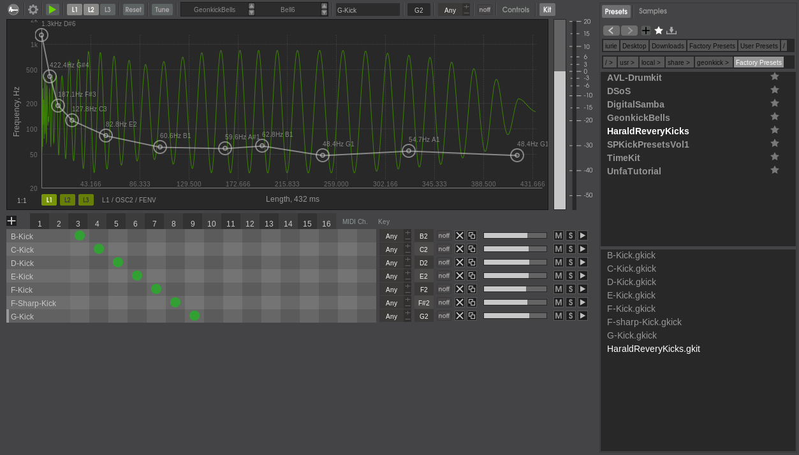

# Geonkick

**Geonkick** - a [free software](https://www.gnu.org/philosophy/free-sw.en.html) percussion synthesizer.

**Website:** [https://geonkick.org](https://geonkick.org)

Geonkick is a free software synthesizer capable of generating
a wide range of percussive sounds, including kicks, snares,
claps, hi-hats, shakers, and unique effect sounds.

**License:** GNU General Public License, Version 3

**Version:** 3.6.1

## Download

Source code repository:

- https://codeberg.org/Geonkick-Synthesizer/geonkick
- https://gitlab.com/Geonkick-Synthesizer/geonkick
- https://github.com/Geonkick-Synthesizer/geonkick

## Features

* Kit
   - 16 instruments
   - user configurable MIDI key mapping for instruments
   - Save / Load kit in JSON format
   - Export instrument kit to SFZ
* Multichannel
   - 16 stereo audio output channels
   - user configurable mapping of kit instrument to output channels
   - 16 input MIDI channel, user configurable mapping of instruments to MIDI input channels
* 3 layers
* Layers Mixer
* 3 oscillators per layer
     - sine, square, triangle, saw-tooth, noise(White & Brownian), sample (wav, ogg, flac)
     - initial phase control
     - amplitude, frequency, noise density, and sample pitch shift envelope
     - low, band and high pass filter, cutoff & resonance envelope
     - distortion (hard-clip, tan, arctan, log, exp, polynomial)
* FM synthesis
     - OSC1->OSC2
* General
     - amplitude envelope & kick length
     - low & high pass filter, cutoff envelope & resonance envelope
     - limiter
     - distortion (hard-clip, tan, arctan, log, exp, polynomial)
     - distortion drive envelope
     - tune percussion option (relative to key A4)
* Key velocity sensitive for instrument total output amplitude
* Jack support
* Export
     - mono, stereo
     - WAV: 16, 24, 32 bit
     - FLAC: 16, 24 bit
     - Ogg
     - SFZ
* Load & Save presets in JSON format
* Preset & Sample browser
* Standalone
* Pitch to note
* LV2 & VST3 Plugin
     - "Single" version that supports one
       instrument and one stereo channel per instance.
     - The default version that supports kits of 16 instruments
       and 16 output stereo channels per instance.
* Operating System:
     - GNU/Linux (LV2, VST3, Standalone)
     - Windows (LV2, VST3)
* Scale the UI by factor (useful for HiDPI)

## Requirements

In order Geonkick to run and operate correctly there is a need

for standalone:

* GNU/Linux operating system
* Jack server running

for plugin:

 * GNU/Linux or Windows operating system.
 * A host that supports LV2 or VST3 plugin format.

## Build & Install

##### Install dependencies

In order to build Geonkick there is a need to install
the following development packages:

* libsndfile
* RapidJSON
* JACK Audio Connection Kit
* LV2 development library

On Debian, Ubuntu, Ubuntu Studio install:

    apt-get install build-essential cmake libjack-dev libsndfile-dev rapidjson-dev lv2-dev libcairo2-dev

##### Build & install Geonkick

Clone the Geonkick code repository, compile and install.

        copy the source code of the latest release
        mkdir geonkick/build
        cd geonkick/build
        cmake ../
        make
        make install

##### Build Geonkick with VST3 Plugin

Get VST3 SDK than build Geonkick VST3 plugin:

        mkdir geonkick/build
        cd geonkick/build
        cmake -DVST3_SDK_PATH=<full system path to VST3 SDK folder> ../
        make
        make install

##### Building on Windows

To build on Windows, there is a need to install MSYS2/UCRT64 and follow
the same steps as mentioned above.

## Documentation

 [doc/Geonkick_User_Guide.md](doc/Geonkick_User_Guide.md)
