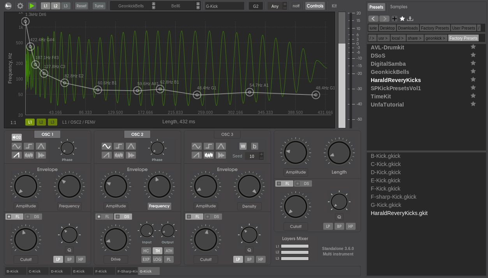

# Geonkick

Geonkick - a [free software](https://www.gnu.org/philosophy/free-sw.en.html) percussion synthesizer.

Geonkick is a synthesizer that can synthesize elements
of percussion. The most basic examples are: kicks,
snares, hit-hats, shakers, claps.

Author: Iurie Nistor

License: GPLv3

Version: 1.10.0 (version 1.10.0 not released yet)

Note: version 1.10 is not compatible with older versions

If you have an idea about a feature or found an issue, please, submit it:

* on [GitLab](https://gitlab.com/geontime/geonkick/issues)
* on [GitHub](https://github.com/geontime/geonkick/issues)

#### Download

Source code repository:

https://gitlab.com/geontime/geonkick

Latest releases can be found on [tags](https://gitlab.com/geontime/geonkick/-/tags).

Latest stable features added are on ["master" branch](https://gitlab.com/geontime/geonkick/commits/master)

#### Features

* Percussion kit
   - Supports up to 16 percussions.
   - Save / Load kit in JSON format
* Multitibral
   - 16 midi keys range
   - user configurable key mapping
* Multichannel
   - for LV2 plugin up to 16 output audio channels
   - for standalone 1 output channel
   - user configurable mapping of kit percussions to channels
* 3 layers
* Layers Mixer
* 2 oscillators per layer
     - sine, square, triangle, saw-tooth, sample (wav, ogg, flac)
     - initial phase control
     - amplitude & frequency envelope
     - low, band and high pass filter, cutoff envelope
* FM synthesis
     - OSC1->OSC2
* One noise generator per layer
     - white & brownian
     - amplitude envelope
     - low, band and high pass filter, cutoff envelope
* General
     - amplitude envelope & kick length
     - low & high pass filter, cutoff envelope
     - limiter
     - compression
     - distortion
     - distortion drive envelope
* Key velocity sensitive
* Jack support
* Export
     - stereo & mono
     - WAV: 16, 24, 32 bit
     - FLAC: 16, 24 bit
     - Ogg Vorbis
* Open & Save percussion preset in JSON format
* Standalone
* Pitch to note
* Plugin
  - LV2
* Platforms:
  - GNU/Linux

#### Demo & Examples

Here is a [list of videos and tutorial](https://www.youtube.com/playlist?list=PL9Z4qz_xHZ-JfNARCWeR1Jx8Cf1upcWwY) about Geonkick.

#### Presets

In the directory geonkick/presets can be found some example presets.

#### Requirements

In order Geonkick to run and operate correctly there is a need for:

Standalone:

* GNU/Linux operating system
* Jack server installed and running at 48000 sample rate

Plugin:

 * GNU/Linux operating system.
 * LV2 host. For example, a DAW that supports LV2 plugin format, running at 48000 sample rate.

#### Install

###### Install dependencies

In order to build Geonkick there is a need to install the following development packages:

* [Redkite](https://github.com/geontime/redkite) GUI toolkit.
* libsndfile
* RapidJSON (version >= 1.1)
* JACK Audio Connection Kit (optional if building only for LV2)
* LV2 development library

On Debian, Ubuntu, Ubuntu Studio install:

    build and install first Redkite, than:
    apt-get install build-essential
    apt-get install cmake
    apt-get install qjackctl libjack-dev libsndfile-dev
    apt-get install rapidjson-dev
    apt-get install lv2-dev

###### Build & install Geonkick

Clone the Geonkick code repository, compile and install

        git clone https://gitlab.com/geontime/geonkick.git
        mkdir geonkick/build
        cd geonkick/build
        cmake ../
        make
        make install

#### Packaging

Geonkick can be found in the repository of ArchLinux, OpenSUSE, Fedora, Manjaro, FreeBSD, KXStudio and others.

Notes:

GKICK_REDKITE_SDK_PATH for cmake will point where Redkite GUI tookit is installed.

#### Documentation

Please, see the documentation at:

 * GitLab: https://gitlab.com/geontime/geonkick/-/wikis/Geonkick-Documentation
 * GitHub: https://github.com/geontime/geonkick/wiki/Geonkick-Documentation
