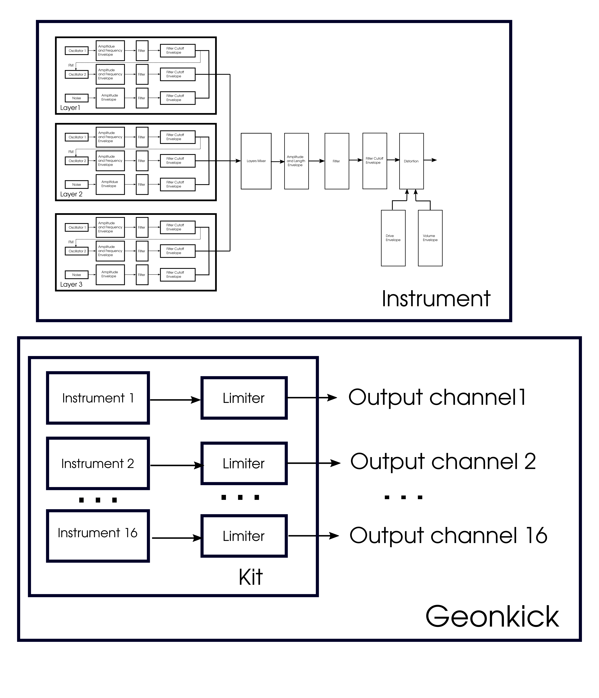

- [Introduction](#introduction)
- [How it works](#how-it-works)
- [Block diagram](#block-diagram)
- [Percussion](#percussion)
  * [Percussion layers](#percussion-layers)
  * [Playing percussion](#playing-percussion)
  * [Percussion UI](#percussion-ui)
  * [Top bar](#top-bar)
  * [Shortcut Keys](#shortcut-keys)
  * [Percussion envelope area](#percussion-envelope-area)
  * [Envelope points](#envelope-points)
  * [Envelope point label](#envelope-point-label)
  * [Percussion graph](#percussion-graph)
  * [Percussion preset](#percussion-preset)
  * [Oscillator](#oscillator)
  * [Noise generator](#noise-generator)
  * [General controls](#general-controls)
  * [Limiter](#limiter)
  * [Filter](#filter)
  * [Distortion](#distortion)
  * [Compressor](#compressor)
  * [Tune](#tune)
  * [Export](#export)
- [Kit](#kit)
  * [Default kit state](#default-kit-state)
  * [Kit UI](#kit-ui)
  * [Current percussion](#current-percussion)
  * [Kit output channels](#kit-output-channels)
  * [Kit preset](#kit-preset)
  * [Kit preset vs percussion preset](#kit-preset-vs-percussion-preset)
  * [Preset browser](#preset-browser)
  * [Percussion vs channel](#percussion-vs-channel)
  * [Sample browser](#sample-browser)
- [LV2 Plugin](#lv2-plugin)
- [Standalone](#standalone)
- [Install](#install)
- [Tutorials](#tutorials)
- [Documentation license](#documentation-license)

### Introduction

Geonkick is a [free software](https://www.gnu.org/philosophy/free-sw.en.html) percussion
synthesizer, currently available only for GNU/Linux. It can synthesize elements of percussion.
The most basic examples are: kicks, snares, hit-hats, shakers, claps. Geonkick is released
under The GNU General Public License version 3. Developed in C and C++ and uses CMake
build system. Can be used as standalone and LV2.

### How it works

Geonkick synthesizes the full percussion length in a buffer in the memory
every time the user changes the controls or the envelopes. The generated
percussion then is "moved" to a module that plays the percussion. There
is no synthesis happening when the user presses a key, i.e if no controls
are changed Geonkick acts just like a sampler.

There is also a list of synthesized percussion that make Geonkick to act
like a percussion kit with key mappings. Percussion UI (main window) actually
is like an "editor" for the selected percussion from the kit list.

Every percussion from the kit list is mono. The percussion can be redirected
to audio output to one of 16 stereo audio output channels. Since percussion is mono, left and right of a stereo channel are the same.

### Block diagram

### Percussion

Percussion is a percussive sound generated by the Geonkick synthesizer.
Its maximum length can be 4 seconds. This sound is played by Geonkick
when an associated MIDI key is pressed.

Geonkick can handle up to 16 percussion in parallel, thus, making it a
multi-timbral synthesizer. There is always a current selected percussion
that can be modified by the percussion UI. The user can select every
percussion from the kit list and modify it.

#### Percussion layers

A percussion consists of 3 layers that can be turned on/off with the
buttons "L1", "L2" and "L3" from the top bar menu. Every layer contains
the 2 oscillators and the noise generator. The sum of thee layers are passed
to general controls. The contribution of every layer to the output can
be controlled by the "Layers Mixer". There is only one controllable layer
by the UI but the user can switch the layer by pressing the button
"L1", "L2", or "L3" from the envelope area.

#### Playing percussion

Every time the user presses the percussion associated key Geonkick will
play the percussion until the end or until the key was released. If the
key was released before the end of the sound, Geonkick will apply a 30 ms
linear decay of the sound.

If there are changes in controls during the percussion play, changes will
be played only at the next press of the key. The percussion graph instead
will show the changes instantly.

#### Percussion UI

The UI of the percussion is actually the main window of Geonkick. It shows
the percussion graph, envelops and controls. Also, there is a menu for open
and save percussion preset, export percussion. 

#### Top bar

   - "Open" and "Save" buttons - opens a dialog for opening or saving
     the percussion preset
   - "Export" button - shows a dialog for exporting the current percussion
     to an audio file format
   - Play button - triggers Geonkick to play the current percussion
   - "L1", "L2" and "L3" -  buttons to turn on/off the layer 1, 2, and 3.
   - "Reset" - reset the current percussion to default
   - "Tune" - checkbox will turn on/off tuning of the current percussion.
   - Preset label - it shows the name of the current selected percussion,
     by default shows "Default".
   - "Contorls", "Kit", "Presets" and "Samples" is submenu that will switch to controls, kit, preset and sample browser UI

#### Shortcut Keys

* Ctrl + k - play the percussion sound
* Ctrl + r - reset the current percussion to default
* Ctrl + h - hide envelope, only the graph is shown
* Ctrl + o - open file browser dialog
* Ctrl + s - open save dialog
* Ctrl + e - open export dialog
* Ctrl + c - copy current selected percussion
* Ctrl + v - paste the copied percussion into the current selected percussion
* Left Ctrl + f - scale up the UI by factor of 2 or restore the original
* Up/Down - to navigate into the kit list
* Ctrl + Up/Down - to move up/down the position of the current selected percussion from the kit list

Note:
   - when running as plugin be sure the focus to be on the main Geonkick window.

#### Percussion envelope area

Percussion envelopes area will show:

   - Percussion graph, it is shown in real time the synthesized percussion graph
   - Envelopes, various types of envelopes shown on top of the percussion graph
   - Envelopes points - can be added, removed and moved by the user. Show the
     values of the envelopes.
   - Envelope path label, shows the current selected envelope type and category.
     For example, "L1/OSC1/AMPL" means the amplitude envelope of the "Layer 1"
     of "Oscillator 1".
   - Buttons "L1", "L2", "L3" will set envelope area to display only
   the envelopes for the layer 1, 2, or 3

#### Envelope points

The user can add, remove or move an envelope point. The user can't remove the
default first and list points, just move them.

  - "left click" to select and move the point
  - "left double click" to add a new point
  - "right click" on the point to remove the point

#### Envelope point label

Envelope points have labels that show the current value related to vertical axes:
amplitude, frequency etc.
For frequency envelope or cutoff there is also an additional point label that
maps the current frequency to a midi key.

Note: Point keys labels in reality are shown not only for an exact frequency
      but for a frequency region that are close or exact to the particular key.

#### Percussion graph

Percussion graph will show in real time the synthesized percussion. Every time
the user changes the percussion parameters, Geonkick will generate a new
graph and update it.

If the sound exceeds the range -1.0 - 1.0, the sound is hard limited to value
1.0 or -1.0. This can be seen in the percussion graph.

Issues: For strictly periodic signals that have high frequency and makes the
graph to be dense the graph may suffer from aliasing for some specific
frequencies. This will not be reflected to sound or exported sound.

#### Percussion preset

The percussion preset is a JSON format, and its file extension is "*.gkick".
Can be opened and saved by the percussion UI by using the buttons
"Open" and "Save" from the top bar.

#### Oscillator

Every layer has two oscillators the output of which are mixed with noise generator,
thus, the result makes the output of the layer. All controls related to oscillator
are grouped and arranged vertically.

   - "Oscillator1" and "Oscillator 2" - checkbox that tun on/off the oscillator
   - "Osc1->Osc2" - checkbox that makes the output of Oscillator1 to FM modulate "Oscillator2"
   - "Sine", "Square", "Triangle", "Sawtooth" - types of periodic wave function of oscillator
   - "Sample" - an additional oscillator function type that represents a
     sampler of maximum 4 seconds length
   - "..." - button to browse and load a sample (WAV, FLAC or OGG)
   - "Phase" - changes the initial phase of the oscillator. For sample this will
     move the start of the sample up to 1/2 of the percussion length
   - Amplitude knob - sets the maximum current amplitude of the oscillator
   - Frequency knob - sets the maximum current frequency of the oscillator
   - Pitch kbob - will set the pitch shift range when the wave funciton of the oscillator is set as sample
   -  pitch buttons will show the evelopes. 
   - "Filter" button will enable/disable filter for the oscillator
   - Oscillator envelopes for amplitude, frequency, pitch shift, filter cutoff can be accessed with buttons
   "Amplitude", "Frequency", "Pitch", and "Cutoff"

#### Noise generator

Noise generator generates noise of two types: white and brownian.

- "Amplitude" - maximum noise amplitude, and the amplitude envelope
- "White" and "Brownian" - noise type
- "Seed" - the slider that can set the different seeds for noise generator
- Filter - the same controls as for oscillators

Loading/saving presets will preserve the noise pattern and seed.

#### General controls

General controls are applied after layers mixer. Arranged vertically,
and applied from top to bottom. The compressor is applied the last one.

- Amplitude knob controls the maximum amplitude after the layers mixer.
- "Amplitude" buttons shows the general amplitude envelope
- Filter (the sample controls as for oscillator)
- Distortion
- Distortion drive and volume envelopes can be accesed with buttons "Drive" and "Volume"
- Compressor

#### Limiter

The limiter control is not part of the synthesis module, but is applied
to the audio output of the percussion. Its UI controls only the current
selected percussion.

Issues:

   - When playing the percussion and at the same time the user changes the
     limiter fast, there may be sound artifacts due to abrupt changes of the sound.
     To decrease the total output amplitude better to use "General"
     controls for the amplitude.

#### Filter

Geonkick implements digital state variable filter that is applied for oscillators,
noise generator and after layers mixer, i.e. general filter.

Here are the parameters:

  - "Filter" - buttons that enable/disale filter
  - Cutoff knob - controls the cutoff frequency of the filter, the range is logarithmic (20Hz - 20kHz).
  - "Cutoff" - the button the will show the cutoff envelope
  - Resonance "Q". The knob is logarithmic ranging from 0.01 to 10.
  - Filter type "LP", "BP", and "HP". Buttons for low-pass, band-pass, and high-pass.

Issues:
   - The filter becomes unstable for some extremal combination of cutoff frequency and Q parameter.
   If the filter becomes unstable the percussion graph will be hard limited.
   There is a need to work with Q factor in order to use the cutoff in the desired range.

#### Distortion

The distortion effect is applied after general filter. Has the following controls:

 - Input - the limiter for the input
 - Volume - the output volume
 - Volume envelope (accessed with "Volume" button)
 - Drive - controls the amount of distortion
 - Drive envelope (accessed with "Drive" button)

#### Compressor

The compressor is applied after distortion, and has the following controls:

 - "Attack"
 - "Threshold"
 - "Ratio"
 - "Drive"

Note:
    - Compressor is not a standard compressor, it only compresses the amplitudes
      signals with a zero release time. It is useful more for creating distortion.
      It is recommended better to use a dedicated compressor for standard sound compression.

#### Tune

In the top bar the "Tune" checkbox tun on/off tuning for the current selected
percussion. When enabled Geonkick will stop mapping percussion to a particular
key and start to tune the sound relative (in number of semitones) to
the un-tuned key A4.

Notes:
   - "Tune" will not make Geonkick to be polyphonic.

#### Export

Export is a dialog that can be opened by pushing on "Export" button from the top bar.
I has the following inputs:

  - file format: "FLAC16", "FLAC24", "WAV16", "WAV24", "WAV32", "Ogg"
  - "Path" - the path where to export the file
  - "File name"
  - "Stereo" or "Mono", exports into a file with one or two identical channels.

Geonkick will export only the current selected percussion.

### Kit

Geonkick is multitimbral by default. Every synthesized percussion Geonkick will put in
a list that makes a kit of up to 16 percussion. To access the kit UI the user needs to
push the button "Kit" on the right side of main UI.

#### Default kit state

When the user opens a new Geonkick instance it will just have single a default percussion
in the kit UI list, and the key mapping for this percussion will be set to any key.
The channel of the default percussion will be directed to 0 channel number.

#### Kit UI

The percussion list size has maximum limit of 16 percussion, and shows the name and
the MIDI key mapping of the percussion, thus forming a grid. The percussion UI will
show the current selected percussion from the list that can be controllable. In the
kit list the current percussion will be emphasized too.

 - "left click" on the percussion name to select the current percussion
 - "left double click" on the percussion name to edit its name
 - "add" button (an icon with "plus") to add a new default percussion
 - "open" button (an icon with an up arrow) opens an kit preset
 - "save" button (an icon with an down arrow) save the kit preset
 - "remove" button (an icon with cross) will remove the percussion
 - "copy" button will copy a percussion and add it into the list
 - the button and the and of percussion line will show a popup for selecting the MIDI key
 - the columns labels shows the MIDI key a percussion can be mapped. "Any" label
   tells that the percussion will be played by pressing on any key.
 - "green circle" - which percussion to which output channel is mapped, and can be changed
   by "left click" on the grid cell.
 - slider for limiter of the current percussion
 - "M" button - mute the current percussion
 - "S" - solo the current percussion

#### Current percussion

When the user selects a percussion from the kit list, it becomes the current
controllable percussion by the percussion UI.The percussion UI will show the
graph and envelopes of the current percussion. Changing controls will make the
Geonkick to synthesize the current percussion only.

When the user opens a percussion preset ("Open" button from the top bar) than
the current selected percussion is updated to the opened preset. Also, when
the user saves a percussion it will save only the preset of the current
selected percussion. The same is for export.

#### Kit output channels

There are maximum 16 stereo audio output channels to which the user can map the percussion.
When adding new percussion by default it will be mapped to channel 1.

Note:
    Standalone supports only 1 stereo channel.

Issues:
     Changing the percussion channel may cause abrupt interruption of sound
     during playing, and sharp start of playing thought the next selected
     channel. This may cause unpleasant sound.

#### Kit preset

Kit preset is a JSON format with file extension "*.gkit", and includes the
list of all percussion presets from the kit. The user can save and open this
preset from the kit UI.

#### Kit preset vs percussion preset

Percussion preset is a preset for one percussion and can be loaded by
percussion UI. Kit preset contains a list of percussion presets
and can be loaded by kit UI.

#### Preset browser

Preset browser can be opened by pushing button "Presets" on the top bar.

Preset browser will list in the first column the name of the presets folders.
A preset folder may contain percussion and kit presets. If the folder
is selected the browser will list all the presets in selected folder in the next columns.
Kit presets will be emphasized with prefix "KIT:".

Note: for now the browser doesn't support search and can't add or remove presets from the UI.

Note2: In order to add new presets in the browser there is a need to save in one of the
following paths the presets (of both types, kit or percussion), than reopen the
program or reload the plugin:

    /usr/share/geonkick/presets/<PresetFolder>/<Preset>
    /usr/local/share/geonkick/presets/<PresetFolder>/<Preset>
    /home/<user>/.local/geonkick/presets/<PresetFolder>/<Preset>

Note3: default Geonkick presets are installed under

    /usr/share/geonkick/presets/
    or /usr/local/share/geonkick/presets

#### Percussion vs channel

Percussion and channels from the Kit UI are different things. A percussion
from the kit UI can be redirected to any audio output channel
(from 1 - 16 channel number). Thus, multiple percussions can be redirected
to a single channel. Multiple channels for a single percussion is not
possible from Kit UI (the host may provide this feature).

#### Sample browser

This is a file dialog browser for samples files (wav, flac, ogg). The user can select and load
a sample into osc1 or osc2. There is a preview side where the selected file can be played and previewed. The preview sound goes thought the first stereo channel (it must be connected in the host for plugin case).

### LV2 Plugin

There are two version of the plugin the default one and "Single" version.

- The default plugin version supports kits of 16 instruments
   and will created 16 stereo audio output channels per plugin instance.
   One instance of this plugin will take about 35MB from the heap.

 - The "Single" plugin version doesn't support kits and has only one
   instrument and one stereo audio output channel. The UI will not have kit
   or anything related to kits. One instance of this version will
   take about 2BM from the heap. If only one instrument per track is used,
   it is recommended to use the "Single" version of the plugin.

### Standalone

The standalone version of Geonkick has the same features as LV2 plugin
but has only one audio output channel and one MIDI input channel.

### Install

Please, see README file how to build and install Geonkick.

### Tutorials

Here is a list of videos that show how to synthesize various percussion with Geonkick:

* YouTube: https://www.youtube.com/playlist?list=PL9Z4qz_xHZ-JfNARCWeR1Jx8Cf1upcWwY

### Documentation license

Geonkick documentation is released under CC-BY 4.0 license.
