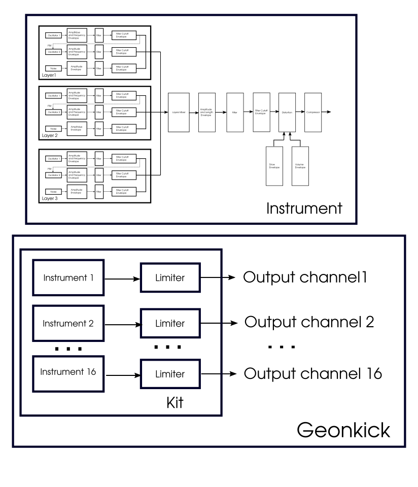

## Table of Contents

1. [Introduction](#introduction)
2. [The Sound Designer Craft](#the-sound-designer-craft)
3. [How it works](#how-it-works)
4. [Block Diagram](#block-diagram)
5. [Instrument](#instrument)
   - [Instrument Layers](#instrument-layers)
   - [Playing Instrument and Note off](#playing-instrument-and-note-off)
   - [Instrument UI](#instrument-ui)
   - [Top Bar](#top-bar)
   - [Shortcut Keys](#shortcut-keys)
   - [Instrument Envelope Area](#instrument-envelope-area)
   - [Envelope Points](#envelope-points)
   - [Bézier Curve for Envelopes](#bézier-curve-for-envelopes)
   - [Envelope Point Label](#envelope-point-label)
   - [Manually Input Envelope Point Value](#manually-input-envelope-point-value)
   - [Display Current Selected Coordinates of Envelope Point](#display-current-selected-coordinates-of-envelope-point)
   - [Instrument Wave Form](#instrument-wave-form)
   - [Instrument Preset](#instrument-preset)
6. [Oscillator](#oscillator)
7. [Global Controls](#global-controls)
8. [Limiter](#limiter)
9. [Filter](#filter)
10. [Distortion](#distortion)
11. [Tune](#tune)
12. [Kit](#kit)
    - [Default Kit State](#default-kit-state)
    - [Kit UI](#kit-ui)
    - [Current Instrument](#current-instrument)
    - [Kit Output Channels](#kit-output-channels)
    - [Instrument vs Channel](#instrument-vs-channel)
13. [Geonkick Preset](#geonkick-preset)
14. [Sidebar](#sidebar)
    - [Preset Browser](#preset-browser)
    - [Sample Browser](#sample-browser)
    - [Export](#export)
15. [Settings](#settings)
16. [LV2 Plugin](#lv2-plugin)
17. [Standalone](#standalone)
18. [Build & Install](#build--install)

# Geonkick User Guide

**Author:** Iurie Nistor

**License:** This work (including all images it uses) is released under [CC0 1.0 Universal (CC0 1.0) Public Domain Dedication](https://creativecommons.org/publicdomain/zero/1.0/deed.en).

**Version:** 3.6.0

**Website:** [https://geonkick.org](https://geonkick.org)

### Introduction

Geonkick is a [free software](https://www.gnu.org/philosophy/free-sw.en.html) percussive synthesizer. It can synthesize various percussive sounds, including kicks, snares, hi-hats, shakers, claps, and other unique sound effects. The synthesizer can also play pre-existing samples and offers features such as pitch modification, allowing users to modify and blend samples and synthesis. Geonkick is released under the GNU General Public License version 3 (and later), developed in C and C++, and utilizes the CMake build system. It can be used as a standalone application and as a LV2 & VST3 plugin. Can run on GNU/Linux and Windows.

### The Sound Designer Craft

Geonkick will not magically improve your percussion sounds. Like with any other synthesizer,
the most important thing is the sound designer's craft and years of experience. Geonkick only
provides the tools necessary to design the sound. Even I, as a developer, could not design
a good kick. For example, [Harald Revery](https://haraldrevery.bio.link/), with his experience in designing percussive sounds, [shows](https://www.youtube.com/watch?v=WnxUgDoOriQ) how
you can actually design a high-quality kick with Geonkick. You can try Harald Revery's kick
presets that were included in the Geonkick project.

### How it works

Geonkick synthesizes the full instrument length sound into a buffer in the memory whenever the user modifies the controls or the envelopes. The resulting instrument sound is then transferred to a module responsible for playing the instrument. There is no synthesis occurring when the user presses a key; in other words, if no controls are altered, Geonkick functions like a sampler. However, this behavior results in the same real-time synthesis experience for the user as common synthesizers.

Additionally, there is a list of synthesized instruments that enables Geonkick to function as an instrument kit with specific key mappings. The Instrument UI (main window) essentially acts as an "editor" for the selected instrument from the kit list.

Each instrument in the kit list is monophonic. However, the instrument can be directed to the audio output of any of the 16 stereo audio output channels. Given that the instrument is monophonic, the left and right channels of a stereo channel are identical.

### Block diagram

### Instrument

An instrument is a percussive sound generated by the Geonkick synthesizer. Its maximum length can be 4 seconds. This sound is played by Geonkick when an associated MIDI key is pressed.

Geonkick can handle up to 16 instruments in parallel, making it a multi-timbral synthesizer. There is always a currently selected instrument that can be modified using the instrument UI. The user can select any instrument from the kit list and modify it.

#### Instrument Layers

An instrument consists of three layers that can be turned on/off using the buttons "L1," "L2," and "L3" in the top bar menu. Each layer contains three oscillators. The sum of these layers is passed to the global controls. The contribution of each layer to the output can be controlled using the "Layers Mixer". Although only one layer is controllable through the UI, the user can switch between layers by pressing the buttons "L1," "L2," or "L3" in the envelope area.

#### Playing Instrument and Note off

Every time the user presses the key associated with the instrument, Geonkick will play the instrument until the end or until the key is released. If the key is released before the sound ends, Geonkick will apply a 30 ms linear decay to the sound if the "noff" button is enabled.

If the "noff" button is disabled, Geonkick will mix the current sound with the next one pressed. This is often useful for playing instruments like crash cymbals.

By default, the "noff" button is disabled. In future releases, this may change.

**Important:** When "noff" is disabled, sounds will accumulate, and if the sound is played repeatedly and very quickly, it may introduce distortion. In such cases, it is better to enable the "noff" button or adjust the instrument limiter, or even the oscillators or effects output.

If there are changes to controls during instrument playback, the changes will only be applied on the next key press. However, the instrument wavefrom will display the changes instantly.

#### Instrument UI

The instrument's user interface serves as the primary window of Geonkick, displaying the instrument wavefrom, envelopes, and controls. Additionally, there is a menu for opening and saving instrument presets, as well as exporting instruments.

#### Top Bar

- **Play button:** Triggers Geonkick to play the current instrument.
- **"L1", "L2", and "L3" buttons:** Turn on/off layers 1, 2, and 3.
- **"Reset" button:** Resets the current instrument to default settings.
- **"Tune" checkbox:** Toggles the tuning of the current instrument. The output instrument sound will be tuned according to the pressed MIDI key.

- **Preset navigator:** The navigator to select factory presetes.
- **MIDI Key:** Displays the current MIDI input key for the instrument. Pressing on the label opens a popup to select a MIDI key for the instrument.
- **MIDI channel:** Spinbox for selecting the current instrument's MIDI channel
- **noff:** Turns off/on for the current instrument to ignore the NOTE OFF when the MIDI key is released.
- **Tabs:** "Controls", "Kit", switch to instrument main controls or kit UI.

#### Shortcut Keys

- **'Ctrl + k':** Plays the instrument sound.
- **'Ctrl + r':** Resets the current instrument to default.
- **'Ctrl + h':** Hides the envelope, showing only the graph.
- **'Ctrl + c':** Copies the currently selected instrument.
- **'Ctrl + v':** Pastes the copied instrument into the currently selected instrument.
- **'Left Ctrl + f':** Scales up the UI by a factor of x1.5, 2x, or restores the original size.
- **'Up/Down arrows':** Navigates the kit list.
- **'Ctrl + Up/Down arrows':** Moves up/down the position of the currently selected instrument in the kit list.
- **'Left Ctrl + left mouse double-click on an envelope point':** Opens the envelope point context input for its value.

**Note:** When running as a plugin, ensure that the focus is on the main Geonkick window and that the key inputs are enabled by the host for the plugin.

#### Instrument Envelope Area

The instrument envelope area displays:

- **Instrument sound waveform:** Shows the real-time synthesized instrument sound wave form.
- **Envelopes:** Various types of envelopes displayed on top of the instrument sound graph.
- **Envelope points:** Can be added, removed, and moved by the user. Display the values of the envelopes points and also have a context input for the value (Ctrl + left mouse double-click on the point).
- **Envelope Path Label:** Shows the current selected envelope type and category. For example, "L1/OSC1/AMPL" means the amplitude envelope of Layer 1 of Oscillator 1.
- **Buttons "L1", "L2", "L3":** Set the envelope area to display only the envelopes for Layer 1, 2, or 3.
- When hovering over/selecting an envelope point, it displays the point's coordinates (value, time) in the bottom right corner area.
- Scroll up/down to zoom in/out the envelope area along the time axis. Also, drag left/right to move the zoomed area.
- A label "1:x" that shows the zoom factor.

#### Envelope Points

Users can add, remove, or move an envelope point. The default first and last points cannot be removed, only moved.

- **Left click:** Select and move the point.
- **Left double click:** Add a new point.
- **Right click:** Remove the point.

#### Bézier Curve for Envelopes

To add a Bézier curve, you need to insert a control point between two node points using Left Ctrl + double-click.

Note: If one of the adjacent points is already a control point, a normal node point will be added instead. You can only add a control point between two existing node points.

#### Envelope Point Label

Envelope points have labels showing the current value related to vertical axes (amplitude, frequency, etc.). For frequency envelope or cutoff, an additional point label maps the current frequency to a MIDI note.

*Note: Point key labels are shown for a frequency region close to or exact to the particular key, not just an exact frequency. The exact value is displayed in the buttom-right corner.*

#### Manually Input Envelope Point Value

Users can set the value of an envelope point manually with a maximum precision of 4 digits after the floating point:

1. Press `Left Ctrl` and double-click on the envelope point. An input context line edit will be displayed.

2. Enter the desired value and press `Enter`.

3. To cancel, press `Esc` or click outside the line edit widget to close it.

#### Display Current Selected Coordinates of Envelope Point

A more exact values of the coordinates of the currently hovered or selected envelope point are shown in the bottom-right area, displaying both value and time in milliseconds.

#### Instrument Wave Form

The instrument wave from shows the real-time synthesized instrument sound. Whenever the user changes instrument controls, Geonkick generates a new graph and updates it.

If the sound exceeds the range of -1.0 to 1.0, the sound is hard-limited to these values, visible in the instrument graph.

*Issues:* For strictly periodic signals with high frequencies that cause the graph to be dense, aliasing might occur for specific frequencies. However, this issue does not affect the played sound or the exported sound itself.

#### Instrument Preset

The instrument preset is in JSON format and uses the file extension "*.gkit".

#### Oscillator

Each layer consists of three oscillators, the outputs of which are mixed with a noise generator to produce the layer's output. Controls related to oscillators are grouped and arranged vertically.

- **"OSC1", "OSC2", and "OSC3":** Checkboxes to toggle the oscillators on/off.
- **"OSC1->OSC2":** Checkbox that allows Oscillator 1 to FM modulate Oscillator 2.
- **Waveform Types:** "Sine," "Square," "Triangle," "Sawtooth," "Noise," "Sample" – options for wave functions of the oscillator.
- **Noise:** The oscillator will generate noise ("w" – white, "b" – brownian). Also, there is a "seed" spinbox to set the noise seed.
- **"Sample":** Represents a sampler with a maximum length of 4 seconds.
- **"...":** Button to browse and load a sample (WAV, FLAC, or OGG).
- **"Phase":** Adjusts the initial phase of the oscillator. For samples, this moves the start of the sample up to 1/2 of the instrument's sound length.
- **Amplitude Knob:** Sets the maximum current amplitude of the oscillator.
- **Frequency Knob:** Sets the maximum current frequency of the oscillator.
- **Pitch Knob:** Sets the pitch shift range when the waveform is set as a sample.
- **Density Knob:** When the noise wave function is selected, this knob controls the density of the noise.
- **Pitch Button:** Shows the envelopes for the pitch shift.
- **Density Button:** Shows the envelope of the noise density.
- **"Filter"** and **"Distortion"** effects buttons: Buttons to enable and switch to the filter or distortion effect UI.
- **Distortion:**
- **Filter:** a digital state-variable filter
  - Cutoff knob and **Cutoff** envelope button, filter types: **LP** (low-pass), **BP** (band-pass), **HP** (high-pass), **Resonance** knob, and **Q** resonance envelope button.

**Note:** Loading/saving presets preserves the noise pattern, seed, and density patern for the oscillator.

#### Global Controls

Global controls are applied after the layers mixer. Arranged vertically and applied from top to bottom.

- **Amplitude Knob:** Controls the maximum amplitude after the layers mixer.
- **"Amplitude" Button:** Shows the general amplitude envelope.
- **"Length":** Sets the maximum sound length of the instrument.
- **Filter:** Similar to oscillator.
- **Distortion:** Similar to oscillator.

#### Limiter

The limiter control is applied to the audio output of the instrument, controlling only the currently selected instrument.

#### Filter

Geonkick implements a digital state-variable filter applied to oscillators, and after the layers mixer (instrument global filter).

Parameters:

- **"Filter" Buttons:** Enable/Disable filter.
- **Cutoff Knob:** Controls the cutoff frequency of the filter in a logarithmic range (20Hz - 20kHz).
- **"Cutoff" Button:** Shows the cutoff envelope.
- **Resonance Knob:** Logarithmic range from 0.01 to 10.
- **"Q" Button:** Shows the envelope for the resonance.
- **Filter Type Buttons:** "LP" for low-pass, "BP" for band-pass, and "HP" for high-pass filters.

The filter becomes unstable for extreme combinations of cutoff frequency and Q parameter. If it becomes unstable, the instrument sound will be hard-limited. Proper adjustments of the Q factor are necessary to maintain desired cutoff frequency ranges. But this behavior can be used as a feature to generate special effect sounds.

#### Distortion

The distortion effect (for oscillators and global) is applied after the filter and has the following controls:

  - **Distortion Type:** Functions used to create distortion: *hard clip*, *tangent*, *arctangent*, *exponential*, *logarithm*, and *polynomial*.
  - **Drive** knob,
  - **Drive envelope Button**,
  - **Input** and **Output** Limiters.

#### Tune

In the top bar, the "Tune" checkbox toggles tuning for the currently selected instrument. When enabled, Geonkick will stop mapping the instrument to a specific key and will tune the sound relative to the untuned key A4 (in number of semitones).

### Kit

Geonkick is multi-instrument by default. Each synthesized instrument is added to a list, forming a kit of up to 16 instruments.
To access the kit UI, click the **"Kit"** button on the top bar of the main interface.

#### Default Kit State

When the user opens a new Geonkick instance, it will have a single default instrument in the kit UI list. The key mapping for this instrument will be set to any key, and the channel of the default instrument will be directed to channel number 0.

#### Kit UI

The instrument list has a maximum limit of 16 instruments and displays the instrument names and their MIDI key mappings, forming a grid. The kit UI will show the currently selected instrument from the list, which can be controlled. In the kit list, the current instrument will be emphasized.

- **Left click:** Selects the current instrument.
- **Left double click:** Edits the instrument name.
- **"Add" button (icon with a plus):** Adds a new instrument.
- **"Remove" button (icon with a cross):** Removes the instrument.
- **"Copy" button:** Copies an instrument and adds it to the list.
- **Spinbox for setting MIDI input channel for an instrument.**
- **Key:** Control to MIDI key the instrument can be mapped to. The "Any" label indicates that the instrument will be played by pressing any key.
- **noff:** Turns off/on to ignore the NOTE OFF when the MIDI key is released.
- **Green circle:** Indicates which instrument is mapped to which output channel and can be changed by left-clicking on the grid cell.
- **Limiter slider:** Controls the limiter for the current instrument.
- **"M" button:** Mutes the current instrument.
- **"S" button:** Solos the current instrument.

#### Current Instrument

When the user selects an instrument from the kit list, it becomes the current controllable instrument in the instrument UI. The instrument UI displays the waveform and envelopes of the current instrument. Changing controls will synthesize the selected instrument.

#### Kit Output Channels

There are a maximum of 16 stereo audio output channels to which the user can map the instruments. When a new instrument is added, it is mapped to channel 1 by default.

#### Instrument vs Channel

In Geonkick's Kit UI, instruments and channels are distinct entities. An instrument from the kit UI can be redirected to any audio output channel (from channels 1 to 16). This allows multiple instruments to be directed to a single channel. However, assigning multiple channels to a single instrument is not possible from the Kit UI (this feature may be provided by the host).

### Geonkick Preset

Geonkick is a preset in JSON format with the file extension "*.gkit" and includes a single or multiple instruments. Users can save and open this preset from **Preset Browser**.

### Sidebar

The sidebar contains the **Preset Browser** and **Sample Browser**. It can be shown or hidden from the settings, and this applies to all Geonkick instances.
Use the top menu of the sidebar to switch between the **Preset Browser** and **Sample Browser**.

Both the Preset and Sample browsers have a top menu with the following controls:

- **"Forward" & "Backwards"** — Navigate through browsing history.
- **"+"** — Create a new directory in the current path.
- **"*"** — Bookmark/unbookmark the current path.
- **Bookmarks bar** — Contains bookmarked paths, as well as default paths like factory presets and user paths.
- **Breadcrumb bar** — Displays the current path as clickable segments for easy navigation.
- **Save/Export button** — In the Preset Browser, saves the current preset. In the Sample Browser, exports the current instrument's waveform.

#### Preset Browser

The Preset Browser includes a list that shows the contents of the currently selected preset folder.
When the user selects a path that contains presets, they will be displayed in the list.

#### Sample Browser

The Sample Browser has additional controls in the bottom bar:

- **"O1, O2, O3"** - When a sample file is selected, pressing one of these buttons will load the sample into the corresponding oscillator (O1, O2, or O3), and the oscillator's waveform will be set to "sample".
- **"Export as"** - A spinbox where the export format can be selected: WAV, FLAC, OGG, or SFZ.
- **"M"**, **"S"** - Export as stereo or mono (not applicable for SFZ format).

#### Export

The export feature can be accessed by clicking the **"Save"** button in the **Sample Browser**.

- **File format:** "FLAC16", "FLAC24", "WAV16", "WAV24", "WAV32", "Ogg", "SFZ"

Geonkick will export only the currently selected instrument.

#### Settings

Settings can be accessed from the top bar. The settings widget allows the user to configure various settings. These settings apply to all Geonkick instances.
For settings to take effect (especially UI-related ones), it may be necessary to restart the UI or even the instance (restart the host, reload the plugin,
or reopen the standalone application).

- **Force all MIDI channels to** - Forces all instrument MIDI input channels to a specific channel (applies to all instances).
- **Scale UI** - Sets the scale of the UI (options: no scale, 1.5x, and 2x). Useful for HiDPI screens.
- **Show sidebar** - Toggles the visibility of the sidebar.

### LV2 Plugin

There are two versions of the plugin: the default version and the "Single" version.

- The default plugin version supports kits with 16 instruments and creates 16 stereo audio output channels per plugin instance.

- The "Single" plugin version does not support kits and only includes one instrument and one stereo audio output channel.

*Note*: VST3 plugin has only the default version (kit version).

### Standalone

The standalone version of Geonkick offers the same features as the LV2 or VST3 plugin.

### Build & Install

For instructions on building and installing Geonkick, please refer to the README file.
